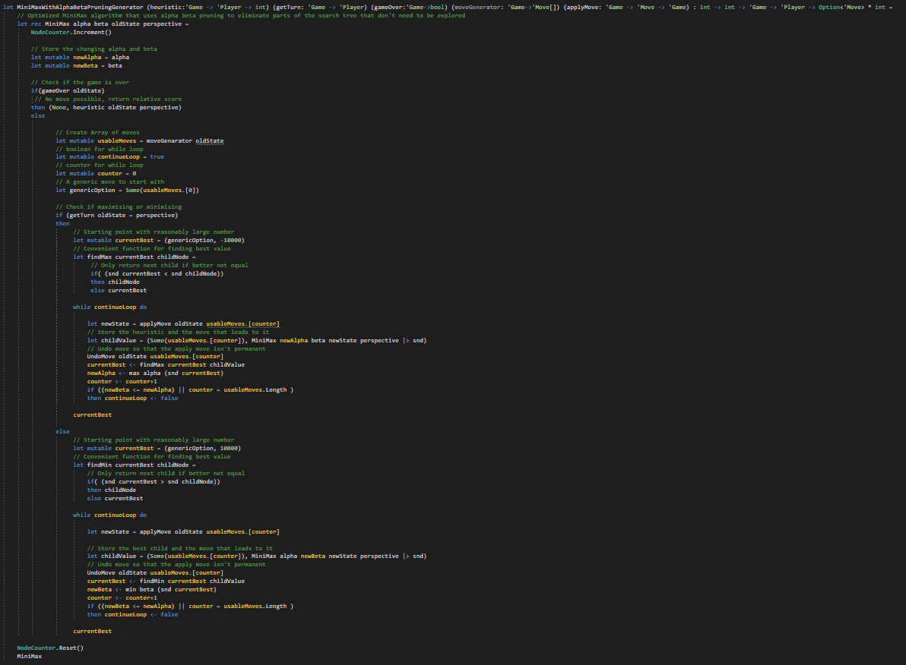
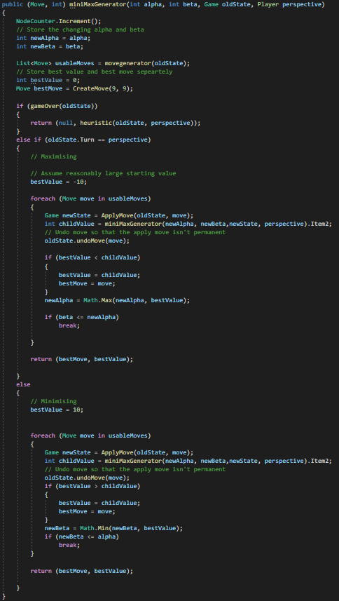
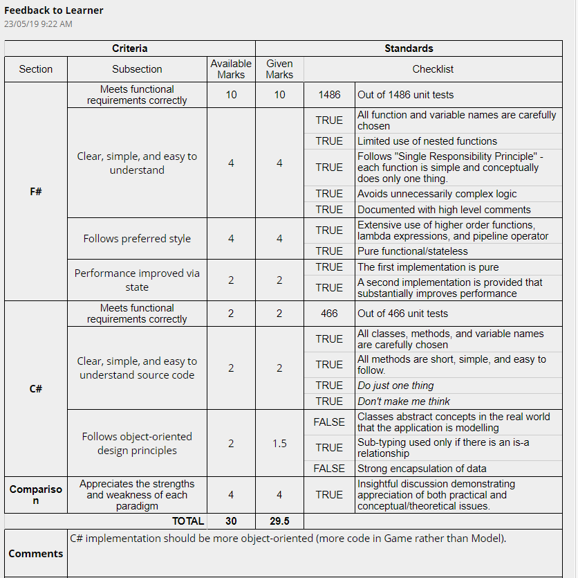

# Minimax in different Programming Paradigms (CAB402)
Minimax algorithm with Alpha beta pruning in Assigment 1 for Programming Paradigms (CAB402). Tic-Tac-Toe through a pure fuctional implementation, impure fuctional implementation, and imperative implementation. 
 
## Minimax with Alpha beta pruning in various styles

           
Pure Functional Implementation

           Found in GameTheory/GameTheory.fs
           

### Pure Functional Implementation
Found in GameTheory/GameTheory.fs

### Impure Functional Implementation
Found in FSharpTicTacToeModels/TicTacToeImpure.fs

### Imperative Implementation
Found in CSharpTicTacToeModels/Model.cs

## Grades

## Authors

* **Jericho Limpin**  [Bubble Rain](https://github.com/Bubble-Rain)
