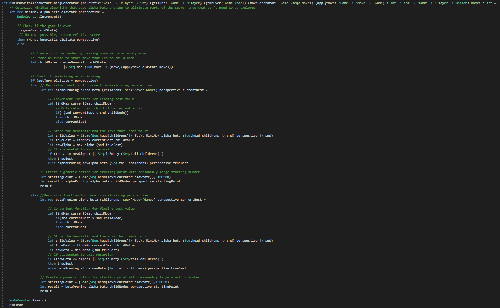

# Minimax in different Programming Paradigms (CAB402)
Minimax algorithm with Alpha beta pruning in Assigment 1 for Programming Paradigms (CAB402). Tic-Tac-Toe through a pure fuctional implementation, impure fuctional implementation, and imperative implementation. 
 
## Minimax with Alpha beta pruning in various styles

 
Pure Functional Implementation

 
Found in GameTheory/GameTheory.fs

 

 
Impure Functional Implementation

 
Found in FSharpTicTacToeModels/TicTacToeImpure.fs

 

 
Imperative Implementation

 
Found in CSharpTicTacToeModels/Model.cs

 

## Grades

## Authors

* **Jericho Limpin**  [Bubble Rain](https://github.com/Bubble-Rain)
